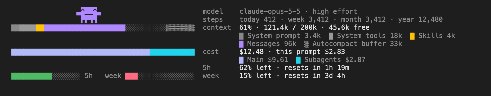

# Penny Patrol

Three meters above your Claude Code prompt: how full the context window is, who spent this session's
dollars, and what is left of your limits. A small mascot walks them while Claude works.



*The mod's own drawing, rendered outside a terminal for this page. Your terminal's theme sets the colours.*

An unofficial community mod for Claude Code. Not affiliated with Anthropic.

## Install

Needs Claude Code 2.1.287 or later.

```sh
claude plugin marketplace add Kumaraman110/penny-patrol
claude plugin install penny-patrol@penny-patrol
```

Start `claude`. The band is above the prompt.

To try it once without installing anything:

```sh
git clone https://github.com/Kumaraman110/penny-patrol
claude --plugin-dir penny-patrol/penny-patrol
```

## Uninstall

```sh
claude plugin uninstall penny-patrol@penny-patrol
claude plugin marketplace remove penny-patrol
rm -rf ~/.penny-patrol    # its saved ledgers and counters; skip this to keep them
```

## What you see

The bars stand at the left, with two free rows over each. Every word is at the right, one line a row,
each under a short label.

| Line | What it says |
| --- | --- |
| `model` | The model, and the reasoning effort once a tool call has reported it. |
| `steps` | Working time, a step a second: today, this week (from Sunday), this month, this year, over every session on this machine. |
| `context` | Beside the context bar: the share in use, tokens in use of the window, and what is free before Claude Code compacts. |
| | Under it, the legend: the categories and colours of `/context`. When they do not all fit, the smallest give way and the line ends on how many (`+2`). |
| | When the legend fits on one line, the last request: everything sent in (and how much of it was read from the prompt cache), and what came out. |
| `cost` | Beside the cost bar: the session's total as Claude Code reports it, and what the current prompt has cost so far. |
| | Under it: who spent it. `Main` is the main conversation, `Subagents` everything it started. What was spent before Penny Patrol first looked is a figure here, not a part of the bar. |
| `5h`, `week` | What is *left* of each limit window your account reports, and when it resets. |
| `month` | For an account billed by the API, which has no such window: the month's spend. |

**The context bar** is the window as one stacked bar. What is in use comes first, then the free space
(dotted), then the autocompact buffer (hatched) at the window's end, so the dotted run is the room left.

*Messages* is the conversation itself: your prompts, Claude's replies and thinking, every tool call and
every tool result. It is not split into input and output, because everything in the window is input to
the next request.

**The limit bars** drain as you use a window: green above half, amber down to a fifth, red below. The
month's bar grows toward the next round figure, or, once you give it a budget, drains that.

**The mascot** stands on a bar and takes the colour of the part under it; over the empty stretch of a
bar it wears its own. While anything runs (a turn, a background shell, a subagent) it takes a step a
second: along the context bar, down, back along the cost bar, down, along the limit bars, and then the
whole way back. When nothing runs it stands where it is.

Its face says how things are:

| Face | When |
| --- | --- |
| `^__^` | walking |
| `-__-` | asleep: nothing is running |
| `>__<` | the meter under it has less than a fifth left: of the room before compaction, of a limit window, of the budget |

**In a small terminal** (narrower than 65 columns, or where the band may not take its nine rows) the
bars are drawn alone, each with its figures, and the mascot stays home.

## Slash commands

Penny Patrol ships one slash command, `/penny-patrol`, with these forms. Type it in the prompt like any
other; each answers at once and none of them sends a request to the model.

| Command | What it does |
| --- | --- |
| `/penny-patrol` | Hide the band, or show it again. This session only; the choice is remembered. |
| `/penny-patrol costs` | Print the ledger: every prompt, what it cost, the tokens that explain it, and the hourly rate while working. |
| `/penny-patrol audit` | Check the figures against each other and against what Claude Code reports. |
| `/penny-patrol budget` | Say what the month's budget is. |
| `/penny-patrol budget <dollars>` | Set the month's budget, for example `/penny-patrol budget 8000`. `$8,000` works too. Every session on this machine takes it up. |
| `/penny-patrol budget off` | Clear the budget. |

Anything else after `/penny-patrol` prints this list in one line.

**`/penny-patrol costs`** prints:

```
Session total reported by Claude Code: $12.48
  itemised below:   $12.48
  before tracking:  $0.00  (spent before this ledger first looked; cannot be itemised)
  unaccounted:      $0.00
  working time:     3,412 steps (56m) · $13.17/h while working
  prompts:          14 · average $0.89 · most expensive $2.83
  this machine:     today $12.48 · week $12.48 · month $12.48 · year $12.48

  1.     $2.83  fix the flaky test in the recovery suite
                main $2.11 · claude-opus-5-5 · in 1.2k, out 8.4k, cache read 2.1M, cache write 35k (98% of input from cache)
                general-purpose "Independent verification of the fix" $0.72 · claude-opus-5-5 · in 400, out 12k, ...
```

**`/penny-patrol audit`** prints one line a check. `ok` holds, `OFF` does not, `note` is a fact with
nothing to check it against:

```
ok   context: the categories in use add up to 121,400; Claude Code reports 121,400 in use
ok   context: in use, free and buffer add up to 200,000; the window is 200,000
ok   context: 121,400 of 200,000 is 61%
note the last request sent 119,800 tokens in (1,200 new, 116,500 read from the cache, 2,100 written to it) and got 1,900 out; the bar's total is Claude Code's estimate for the next one
ok   cost: prompts $12.48 + earlier $0.00 + before tracking $0.00 = $12.48; Claude Code reports $12.48
ok   cost: main $9.61 + subagents $2.87 = the prompts' $12.48
ok   steps: this session's days hold 3,412; its ledger counts 3,412
note limits as read 4s ago by a session on this machine
```

**`/penny-patrol budget 8000`** answers `Budget set: $8,000.00 a month, counted from what this machine's
sessions spend.` and the month's bar starts draining it.

## How the money is tracked

Claude Code reports one figure: the session's total in dollars. Penny Patrol looks at it at every turn
start, tool call and turn end, and books each rise to whoever was acting when it was seen: the main
conversation's current prompt, or a subagent, whose spend belongs to the prompt that started it. So the
entries always add up to the total. Every view rounds from the same whole cents, so no two of them are a
cent apart, and `unaccounted` is always $0.00.

What it cannot know:

- **Anything spent before it first looked.** That is "before tracking": a figure, never itemised.
- **Which of two things running at once caused a rise.** A rise seen while the main conversation and a
  subagent both work is booked to whichever acted next.
- **Prices.** No price list is exposed to a mod, so there is no split of dollars by token type. The
  token counts on each ledger line are the API's own.
- **Your bill.** On a subscription the dollars are Claude Code's API-equivalent figure, not a charge.
- **Your organisation's balance.** The month bar and the totals by period count the sessions on this
  machine that had Penny Patrol loaded. A budget is a number you give it, not one it can read.

A session keeps its last 200 prompts line by line. Older ones fold into a single "earlier prompts"
figure: still counted, no longer listed.

## Is it right?

`/penny-patrol audit` checks, on the spot, that the categories add up to the total Claude Code reports,
that in use plus free plus buffer make the window, that the cents add up to the reported total, and that
the steps saved match the steps counted. A line that does not hold starts with `OFF`. It also gives the
last request in full: new input, tokens read from the cache, tokens written to it, and output.

Two checks you can make yourself: `/context` for the window (its counts come from the token-count API,
so they differ a little from the local estimate the bar uses) and `/cost` for the session's dollars.

The mod ships with a test suite that runs against Claude Code's own engine:

```sh
claude plugin test penny-patrol
```

## Several sessions

Each session has its own ledger, its own counters and its own choice to hide the band, even when two
sessions run in the same folder. The limits and the budget belong to your account, so every session
shows the newest reading any of them saw, within five seconds. The steps by period add all of them up.

## Where it keeps things

Plain JSON files in `~/.penny-patrol`, which you can read:

| File | What it holds |
| --- | --- |
| `sessions/<session id>.json` | That session's ledger, effort and whether it is hidden |
| `days/<session id>.json` | That session's steps and dollars, by day |
| `limits.json` | The newest limit reading any session saw |
| `settings.json` | The month's budget |

It sends nothing anywhere. It reads the session's usage from Claude Code and reads and writes those
files; that is all.

## Notes

- The context figures are Claude Code's local estimate, read after each turn and, during a turn, at most
  once every ten seconds. They cost no extra requests.
- Reasoning effort is only reported to a mod during a tool call, so it appears after the session's first
  one.
- After a turn you interrupt, background work is not seen again until the next turn ends.
- While nothing runs the band is drawn again once a minute, so the reset times keep moving.
- The `[-]` beside the band collapses it; `/penny-patrol` hides it.

## License

MIT. See [LICENSE](LICENSE).
